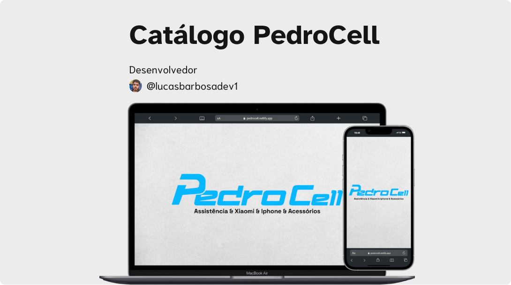

<h1 align="center">
    
</h1>

<h3 align="center"> 
	🚧 Catálogo PedroCell 🚧
</h3>

 <a href="#-sobre-o-projeto">Sobre</a> •
 <a href="#-funcionalidades">Funcionalidades</a> •
 <a href="#-tecnologias">Tecnologias</a> • 
 <a href="#-contribuidores">Contribuidores</a> • 
 <a href="#user-content--licença">Licença</a>

## 💻 Sobre o projeto

📄 Catálogo Web da loja e assistência técnica PedroCell. Com frontend desenvolvido em typescript/angular, e backend utilizando o headless CMS ContentFul.

---

## ⚙️ Funcionalidades

- [x] Funcionalidades:
  - [x] Catálogo Interativo.
  - [x] Redirecionamento dos produtos de interesse do cliente para o whatsapp do estabelecimento.
  - [x] Redirecionamento para o google avaliações e google maps.

---

## 🛣️ Visualização da aplicação no ar

[PedroCell](https://pedrocell.netlify.app/)

---

## 🛠 Tecnologias

As seguintes ferramentas foram usadas na construção do projeto:

-   **HTML**
-   **SASS**
-   **Typescript**
-   **Angular**
-   **Headless CMS ContentFul**

---

## 👨‍💻 Contribuidores

<table>
  <tr>
    <td align="center"><a href="https://www.linkedin.com/in/lucasbarbosadev1/"> <b>Lucas Barbosa</b></a> <a href="https://www.linkedin.com/in/lucasbarbosadev1/" title="Cubos Academy">👨‍💻</a></td>
  </tr>
</table>

---

## 📝 Licença

<!-- Este projeto esta sobe a licença [MIT](./LICENSE). -->

Feito com ❤️ por Lucas Barbosa 👋🏽 [Entre em contato!](https://www.linkedin.com/in/lucasbarbosadev1/)